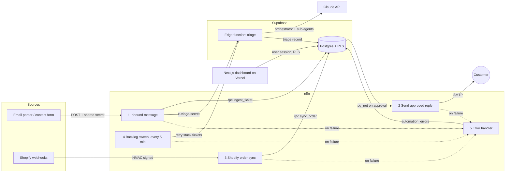

# Technical Design Document: Triage Desk

| | |
|---|---|
| Status | Draft for approval |
| Author | João Santaniello |
| Date | 2026-09-28 |
| Scope | AI triage for inbound customer support messages across several D2C brands |

## 1. Problem

A multi-brand D2C business receives customer emails and form messages for every brand. Most are repetitive (where is my order, will it fit, how do I return it), but each one still costs an agent several minutes of reading, looking up the order and checking the policy before writing a reply. Spam and sales pitches arrive in the same inbox.

## 2. Goals and non-goals

**Goals**

- Every inbound message gets a category, priority, summary and a policy-grounded draft reply within a minute, with the order data already attached.
- Staff approve, edit or escalate from one screen; nothing is sent without a human approval.
- Each brand's data (tickets, orders, policies) is isolated at the database level, not only in the UI.
- Failures are visible and recoverable: no message is silently lost when an API is down.
- Cost and quality are measurable per ticket.

**Non-goals (v1)**

- Fully automatic sending without review.
- Taking actions in the store (refunds, address changes). The agent recommends them and flags a human.
- Replacing the helpdesk for chat and phone.

## 3. Architecture

- **n8n** owns integration and orchestration of systems: inbound messages, Shopify order sync, sending, retries, error capture.
- **Supabase** owns data and security: Postgres, Row Level Security, the triage edge function, Realtime for the live inbox.
- **Claude** owns judgment: understanding the message, deciding which facts to fetch, drafting the reply.
- **Next.js on Vercel** is the staff UI. It never holds the service role key; every query runs as the signed-in user under RLS.

## 4. Data model

| Table | Purpose | Written by |
|---|---|---|
| `brands` | Brand, support email, voice and signature for replies, Shopify shop domain | Admin (SQL) |
| `brand_members` | Which staff user belongs to which brand, with role `agent` or `admin` | Admin (SQL) |
| `policies` | Knowledge base the policy specialist answers from (shipping, returns, contact) | Brand admins in the dashboard |
| `products` | Catalog the product specialist answers from (size and fit, details) | Seed now, Shopify sync later |
| `orders` | Mirror of store orders for lookups | n8n workflow 3 |
| `tickets` | One inbound message and its triage and review state | n8n (insert), triage function (AI fields), staff (review fields) |
| `ticket_events` | Append-only audit trail | Trigger, triage function, n8n |
| `automation_errors` | Failed n8n executions | n8n workflow 5 |

Ticket lifecycle: `new` → `triaged` or `needs_human` (agent) → `approved` (staff) → `sent` (n8n), or `closed` at any point. Spam goes straight to `closed`.

Idempotency: `tickets (brand_id, external_ref)` is unique. The inbound workflow passes the email Message-ID, so a re-delivered message returns the existing ticket and is not triaged twice. Orders upsert on `(brand_id, order_number)`.

## 5. Security

**Row Level Security matrix** (enforced in `supabase/migrations/*_init.sql`, tested in `supabase/tests/database/rls.test.sql`):

| Table | Agent | Admin | Service role (n8n, edge function) |
|---|---|---|---|
| brands, brand_members | read own brands | read own brands | full |
| policies | read | read, insert, update, delete | full |
| products, orders | read | read | full |
| tickets | read; update only `status`, `final_reply`, `assigned_to` | same | full |
| ticket_events | read | read | full |
| automation_errors | none | none | full |

Additional rules:

- Policy helpers `is_brand_member()` and `has_brand_role()` are `security definer` with an empty `search_path`, so policies do not recurse and cannot be hijacked by objects in other schemas.
- A `before update` trigger restricts staff status changes (they cannot set `sent`), requires a reply before approval, stamps `approved_by` and `approved_at`, and writes the audit event.
- Column level grants stop staff from overwriting AI fields or the triage audit data.
- `ingest_ticket` and `sync_order` are executable only by the service role.
- Secrets never reach the browser: the dashboard uses the anon key plus the user session; the service role key lives only in n8n and in the edge function environment.
- Every webhook is authenticated: shared secret headers for the inbound and approved-reply webhooks, constant-time secret check on the triage function, Shopify HMAC-SHA256 over the raw body for order webhooks.
- Customer text is passed to the model inside explicit markers and described as untrusted, and the order tool only reveals details when the sender email matches the order email.
- Webhook URL and secret for the approved-reply trigger live in `private.settings`, a schema the Data API does not expose.

## 6. AI design

**Shape.** One orchestrator agent with three tools, run by the Anthropic TypeScript SDK tool runner inside the edge function:

| Tool | Kind | Context it sees |
|---|---|---|
| `lookup_order` | Deterministic database query, brand scoped | Orders of this brand only |
| `ask_policy_specialist` | Sub-agent (Claude) | Only the brand's policies |
| `ask_product_specialist` | Sub-agent (Claude) | Only the brand's catalog |

The orchestrator decides which tools to call (in parallel when independent), then returns a JSON triage record. Specialists keep large reference texts out of the orchestrator's context and answer from a single source, which makes each answer easier to verify.

**Models and settings.** `claude-opus-5-5` for all calls; orchestrator at `effort: medium`, specialists at `effort: low`. Thinking is adaptive (always on for this model). Server-side refusal fallback is enabled (`fallbacks: "default"`); a remaining refusal marks the ticket `needs_human`.

**Output contract.** Structured outputs (`output_config.format` with a JSON schema) guarantee the record's shape: category, priority, sentiment, language, summary, order number, needs_human and reason, confidence, draft reply, internal note. Tools use `strict: true`. The function re-checks enums and clamps confidence before saving.

**Guardrails in the prompt.** Answer only from tool results; escalate to a human for refunds, replacements, address changes, damage, anger or legal threats, missing order matches and confidence below 0.7; never disclose an order to a non-matching email; never use em dashes. Even escalated tickets get a draft, so the human only confirms the action.

**Caching.** Instructions come first and the per-brand context (voice, signature, policy titles) second with a cache breakpoint, so consecutive tickets of the same brand reuse the prefix. Specialist contexts (policies, catalog) are cached the same way.

**Cost and latency.** Measured per ticket and shown on the metrics page (tokens in and out, seconds, estimated cost at list prices). Targets for v1: under 45 s and under 10 US cents per ticket.

**Quality loop.** The metrics page tracks the share of drafts approved without edits and the share escalated. Edited drafts are kept (`draft_reply` vs `final_reply`) as a labelled set for prompt iteration and for an eval of the categories.

## 7. Workflows (n8n)

| Workflow | Trigger | Steps | Error handling |
|---|---|---|---|
| 1 Inbound message | Webhook `POST /support/inbound` | Validate secret and fields, `ingest_ticket` (idempotent), respond 202, run triage if new | HTTP retries (3 × 5 s), triage timeout 150 s, error workflow, backlog sweep catches anything left in `new` |
| 2 Send approved reply | Webhook from Postgres (`pg_net` trigger on approval) | Check secret, reload ticket, skip unless still `approved`, send via SMTP, mark `sent`, log event | SMTP retries (3 × 10 s), `status=eq.approved` guard makes the update idempotent |
| 3 Shopify order sync | Shopify `orders/create`, `orders/updated` | Verify HMAC on raw body, map fields and status, `sync_order` upsert, respond 200 | Invalid HMAC gets 401 and the execution is failed on purpose so the error workflow records it; Shopify retries on other non-200 answers |
| 4 Backlog sweep | Every 5 minutes | Find tickets still `new` after 2 minutes, retry triage one by one | Per-ticket failures do not stop the batch |
| 5 Error handler | Any failed execution | Insert into `automation_errors` with node, message and execution link | Service-only table, visible to operators. Must be published like the others, or n8n skips it |

## 8. Environments and delivery

- **Local:** `npx supabase start` (Postgres, Auth, Realtime, edge runtime, Mailpit), n8n via `docker compose` pinned to the tested version, Next.js dev server. Approved replies go to Mailpit, so local runs never email real customers.
- **Preview:** every pull request gets a Vercel preview deployment; database changes ship as migrations reviewed in the same PR.
- **Production:** `main` deploys to Vercel; migrations applied with `npx supabase db push`; function deployed with `npx supabase functions deploy triage`; secrets set with `npx supabase secrets set`.
- **Branching:** short-lived feature branches, pull requests into `main`, no direct pushes.

## 9. Testing

- **Database:** pgTAP tests for the RLS matrix and the ticket guard (`npx supabase test db`).
- **Type checks:** `tsc` for the dashboard, `deno check` for the edge function.
- **Agent:** seeded demo tickets cover order status, damage, sizing, address change, return outside the rules and spam; each has an expected category and escalation decision to compare against on prompt changes.
- **End to end:** `scripts/send-demo-messages.mjs` posts messages through n8n and the inbox updates live.

## 10. Rollout

1. Shadow mode for one brand: drafts are generated, staff keep replying as usual and compare.
2. Review mode: staff approve drafts from the dashboard (this design).
3. Per-category auto-send for low-risk categories with high approval-without-edit rates, behind a brand setting. Out of scope for v1.

## 11. Risks

| Risk | Mitigation |
|---|---|
| Wrong or invented policy claims | Specialists answer only from stored policies; human approval before sending; edited drafts feed prompt fixes |
| Data leak across brands | RLS on every tenant table, tests in CI, service key never in the browser |
| Leaking order data to the wrong person | Email match check in `lookup_order`, privacy rule in the prompt |
| Prompt injection in customer text | Text marked as untrusted, tools are read only, no send without approval |
| API outage or rate limits | n8n retries, backlog sweep, refusal fallback, error workflow |
| Cost growth | Effort levels per role, prompt caching, per-ticket cost on the metrics page |
